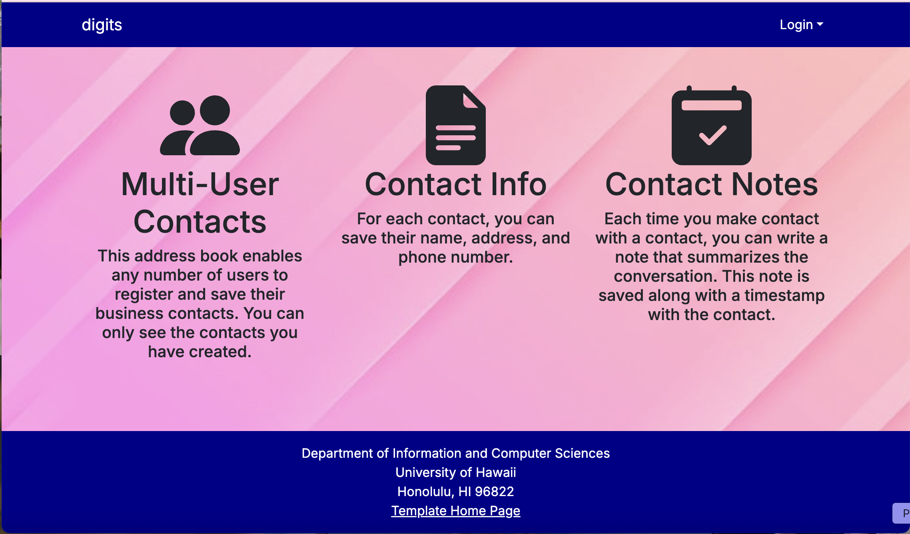
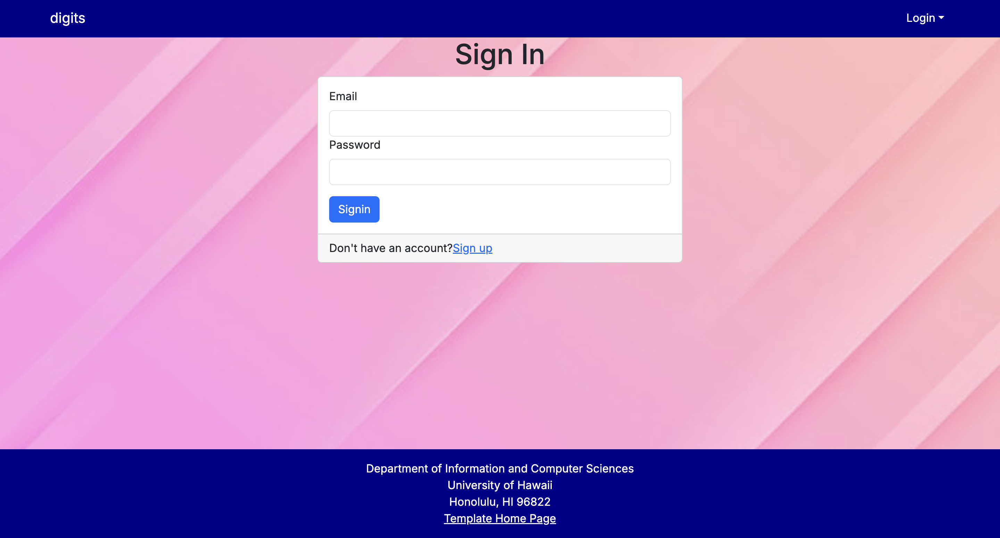
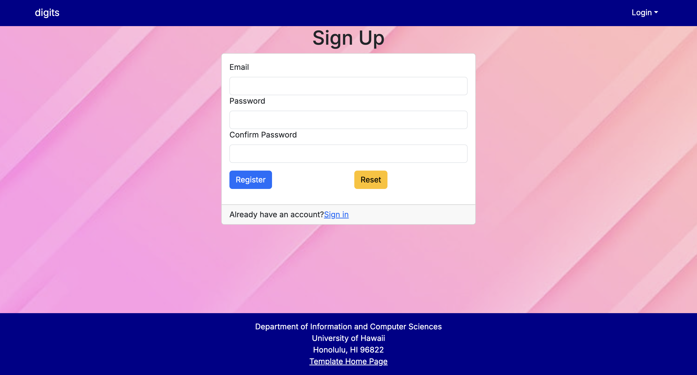
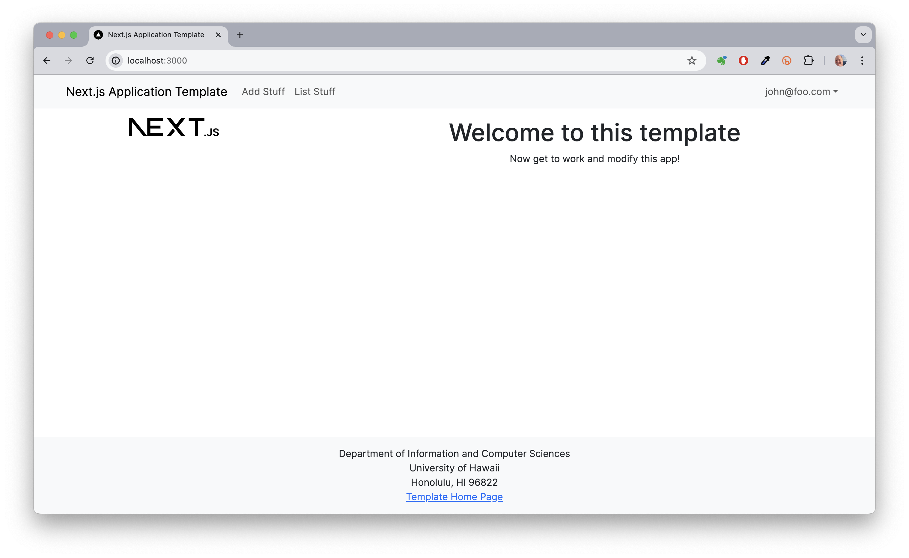
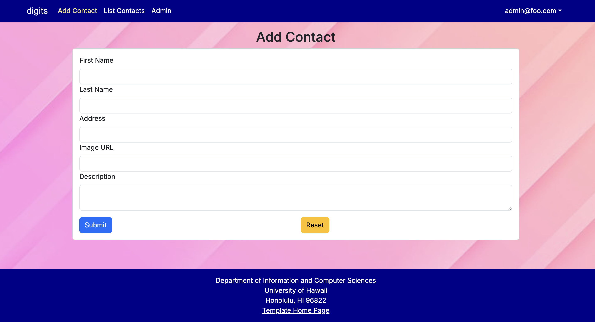
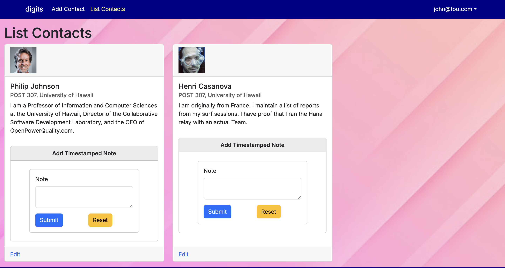
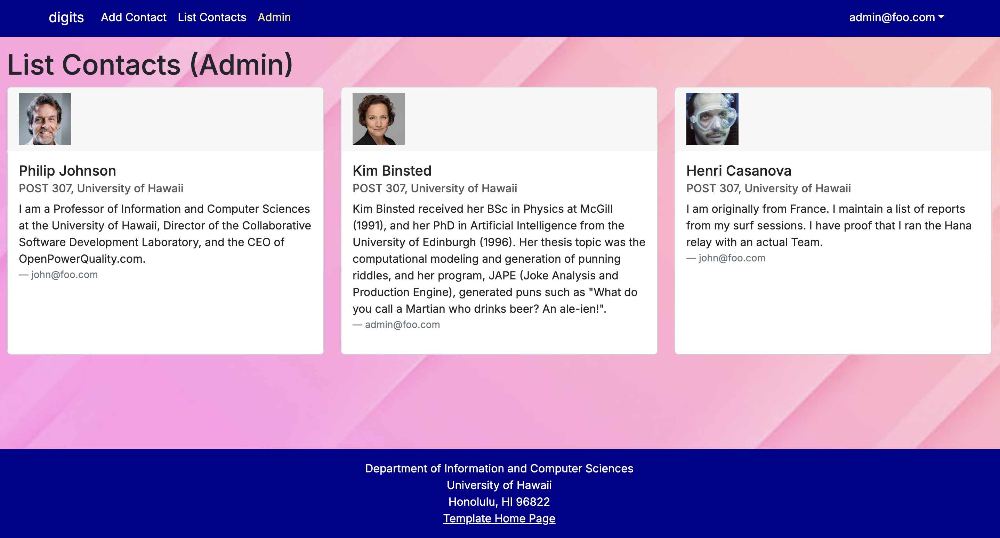

# Contact Management Web Application

This project is a modern contact management application built using **Next.js 14**. It allows users to:

- Register an account and securely log in.
- Add, view, and manage a personal set of contacts.
- Attach timestamped notes to each contact to track interactions.
- Only view and modify their own contacts and notes.
- Admin users can view all contacts and notes from all users.

This project is built using the following technologies:

- [Next.js 14](https://nextjs.org/)
- [React Bootstrap](https://react-bootstrap.github.io/) for responsive UI.
- [React Hook Form](https://www.react-hook-form.com/) for forms.
- [NextAuth.js](https://next-auth.js.org/) for user authentication and roles.
- [Prisma](https://www.prisma.io/) for database access.
- [PostgreSQL](https://www.postgresql.org/) as the database.
- [ESLint](https://eslint.org/) with Airbnb's style guide for code quality.

---

## User Interface Walkthrough

### Landing Page

When the app loads, users see a landing page introducing the system’s features:



---

### Login Page

Users click "Login" in the navbar to access the Sign In form:



---

### Register Page

New users can register by clicking "Sign Up":



---

### Logged-in User View

After login, users will be greeted with this landing page:



---

### Add Contact

Users can add new contacts by filling out a form with name, address, image URL, and a description:



---

### Contact Notes

If logged in as non admin every contact has a section where users can view and add timestamped notes:



---

### Admin View

Admin users see an additional "Admin" menu option. This leads to a dashboard showing all users' contacts and notes:



---

## Features Summary

- Each user has their own private contact database.
- Users can add, view, and edit their own contacts and notes.
- Notes are timestamped automatically.
- Admins can oversee all user data via the admin dashboard.
- User credentials and roles are seeded from a configuration file.
- Designed with responsive and accessible components using React Bootstrap.

---

## Get Started

To get started, follow these steps:

1. **Clone the repository** to your local machine.
2. **Create a PostgreSQL database**, and update the `.env` file with the correct `DATABASE_URL`.
3. Run the following setup commands:

```bash
npm install
npx prisma migrate dev --name init
npx prisma db seed
npm run dev